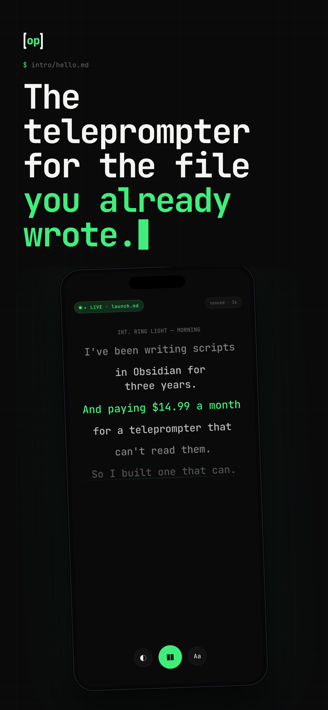
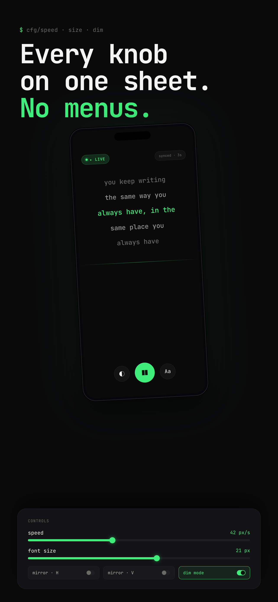
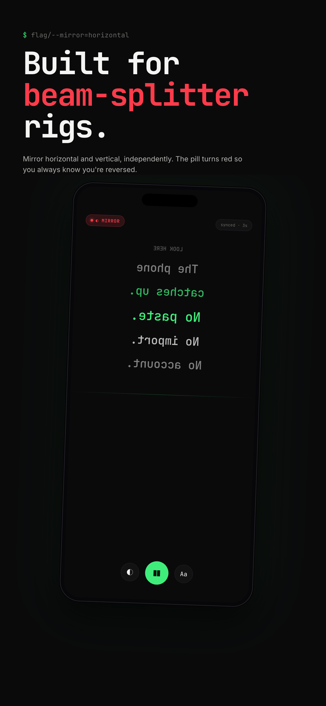

# open prompter

**the free, open-source teleprompter for markdown creators.**

a teleprompter for people who already write in markdown. point it at a folder in iCloud Drive or an Obsidian vault, pick a file, hit play. the file on your mac is the source of truth. no in-app editor battles, no cloud account, no copy-paste.

<a href="https://apps.apple.com/us/app/open-prompter/id6763611915">
  
</a>

[](./LICENSE)
[](https://developer.apple.com/ios/)
[](https://apps.apple.com/us/app/open-prompter/id6763611915)
[](https://openprompter.app)
[](https://buymeacoffee.com/lelanddutcher)

<p align="center">
  
  &nbsp;&nbsp;&nbsp;
  
  &nbsp;&nbsp;&nbsp;
  
</p>


---

## why

every teleprompter app on the store wants a subscription to unlock mirror mode. most want your script uploaded to their cloud. a few want both.

open prompter reads the markdown file you already have, from iCloud Drive or your Obsidian vault, and that's the whole app. free, open source, MIT licensed.

## what it does

### shipped (v1)

- reads `.md` and `.markdown` files from any folder the Files app can reach — iCloud Drive, Obsidian, Dropbox, wherever
- live file-watching — edits on your mac show up on your phone, usually within a minute
- structured rendering — headings render as headings, bullets as bullets, lists as lists
- front matter, callouts, footnotes, `[B-roll: ...]` visual directions stripped automatically
- adjustable scroll speed (5–200 px/s) and font size (16–160 pt) so dense scripts and eye-line reads both work
- mirror mode for teleprompter-rig glass — horizontal, vertical, or both axes
- focus mode dims the chrome for clean recording, with a single visible eye button to bring it back
- on-device edit sheet that teleports to the section you were reading
- zero analytics, zero tracking, zero network calls

### new in v2 (beta)

these are shipping behind the scenes — they work, they've been dogfooded, but the polish dial is still turning. expect rough edges; report bugs.

#### selfie camera with **open-gate recording**

front-camera picture-in-picture so you can frame your shot while you read. the thing creators care about: **open gate** mode reads the iPhone's full 1×1 sensor (3840×3840 on iPhone 17 family) so you have headroom to reframe in post — vertical for shorts, horizontal for YouTube, square for socials, all from one take. zero cropping at capture.

- five aspect ratios: 9:16, 1:1, 4:3, 16:9, **open gate**
- tap the PiP tile to expand to full-screen camera preview, tap minimize to return
- tally light border + dynamic island live activity while recording
- per-take stabilization, mic source picker, quality + framerate controls

#### save next to your script

the toggle that's saved me hours: **save the recording right next to the markdown file it goes with.** in the same folder, with a matching filename. no Photos library hunt, no AirDrop dance — your script and your B-roll live together where you can edit on your mac.

- toggleable destinations: Photos library + same-folder-as-script (or both)
- iCloud Drive recognizes the new file immediately on the desktop
- recovery banner if a take got force-quit mid-write

#### voice-tracked auto-scroll **(beta)**

stop fiddling with the speed slider. tap the voice button (right half of the play button) and read — the prompter follows you. on-device speech recognition; nothing leaves your phone. comes with:

- a draggable reading-band indicator: drag the TOP/BOT handles to set where matched words should land
- horizontal HUD strip (audio meter + last-recognized words + reset) above the controls
- velocity-controlled scroll that smoothly accelerates and decelerates with your pace
- silence detection: pause talking for ~1.5s and the scroll halts so you can scroll back to re-read

#### bluetooth remote control

map keyboard / presenter / media-key events to play, pause, mirror, jump-to-start, and other prompter actions. the hardware-vendor zoo (Logitech R400, AirTurn, Apple keyboards, generic media keys) is supported through one unified event bus.

---

## install

- **App Store** — [Open Prompter](https://apps.apple.com/us/app/open-prompter/id6763611915) (iPhone)
- **build from source** — instructions below

## build from source

```bash
brew install xcodegen
git clone https://github.com/lelanddutcher/open-prompter.git
cd open-prompter
xcodegen generate
open OpenPrompter.xcodeproj
```

set your development team in signing, then run on a simulator or device.

> ⚠️ the `OpenPrompter.xcodeproj` is gitignored. always run `xcodegen generate` after cloning, after adding/removing files, or after pulling.

## architecture

- **SwiftUI**, iOS 17+, dark mode only
- [swift-markdown](https://github.com/apple/swift-markdown) (Apple) for parsing, with a custom visitor that emits typed script blocks and strips scaffolding
- `NSMetadataQuery` on `NSMetadataQueryUbiquitousDocumentsScope` for live file detection
- `UIDocumentPickerViewController` + security-scoped bookmarks for "pick once" folder access
- `TimelineView(.animation)` for frame-rate-independent auto-scroll and the velocity-controlled voice-tracking lerp
- `AVCaptureSession` with pre-attached `AVCaptureVideoDataOutput` + `AVCaptureAudioDataOutput`; `AVAssetWriter` lazily built on the first sample buffer for clean orientation
- `SFSpeechRecognizer` (on-device) for voice tracking, with a custom `ScriptAligner` doing word-level Levenshtein + phonetic-folding + locality-biased matching
- `SwiftData` (with CloudKit off) for the recents cache, `@AppStorage` + `NSUbiquitousKeyValueStore` for preferences, `ActivityKit` for the recording Live Activity


## contributing

PRs welcome. issues tagged `good-first-issue` are a safe entry point. see [`CONTRIBUTING.md`](./CONTRIBUTING.md). project-internal lessons (especially around the iPhone 17 + iOS 26 camera quirks and the voice-tracking algorithm) are in [`CLAUDE.md`](./CLAUDE.md).

## support the project

open prompter is free and MIT-licensed forever. if it saved you a subscription or a hour of fighting your previous teleprompter, [buy me a coffee](https://buymeacoffee.com/lelanddutcher) ☕️ — keeps the lights on for App Store fees, hardware, and shipping more dogfood-tested features.

## license

[MIT](./LICENSE). © 2026 Leland Dutcher.

---

**App Store:** <https://apps.apple.com/us/app/open-prompter/id6763611915>
**Website:** <https://openprompter.app>
**Coffee:** <https://buymeacoffee.com/lelanddutcher>
