# open prompter

**the pro, open-source teleprompter for creators.**

a teleprompter that supports markdown files and every "Pro" feature you need to record content (plus some extras). point it at a folder in iCloud Drive, an Obsidian vault, or anywhere the iOS Files app can reach. pick a file. hit play. read it back at your pace with voice tracking while the selfie camera records you. the take saves to Photos AND back to the same folder as the script — so when you switch to your mac, your edit is sitting next to the .md it came from. no subscription. no account. no cloud upload. no copy-paste.

<a href="https://apps.apple.com/us/app/open-prompter/id6763611915">
  
</a>

[](./LICENSE)
[](https://developer.apple.com/ios/)
[](https://apps.apple.com/us/app/open-prompter/id6763611915)
[](https://openprompter.app)
[](https://buymeacoffee.com/lelanddutcher)

<p align="center">
  
</p>

---

## why

every teleprompter app on the store wants a subscription to unlock mirror mode. most want your script uploaded to their cloud. a few want both. the rest hide the "Pro" features behind a paywall that scales with how serious you are about your craft.

open prompter is the whole feature set, free, MIT-licensed forever. it reads the markdown file you already wrote, records you reading it on the phone you already own, and saves the take where the script came from. that's it.

---

## the reading experience

- **voice tracking** — on-device speech recognition follows what you actually said, so the page advances when you do. nothing leaves the phone, ever. comes with a draggable reading-band indicator (TOP/BOT handles) so the matched word lands exactly where you want, plus velocity-controlled scroll that smoothly accelerates and decelerates with your pace, and silence detection that pauses the scroll if you stop talking for ~1.5s so you can scroll back to re-read.
- **horizontal AND vertical mirror**, independently, for beam-splitter teleprompter rigs.
- **six legibility-tuned fonts** built in: Atkinson Hyperlegible (default), Lexend, System Sans, Verdana, New York (Serif), and the brand monospace.
- **adjustable scroll speed** (5–200 px/s) and font size (16–160 pt) so dense scripts AND eye-line reads both work.
- **focus mode** dims the chrome for clean recording — a single eye button brings it back.
- **full-bleed prompter** with vertical or horizontal rotation. no UI chrome fighting your eye-line.

## camera and recording

- **front camera lives inside the app.** picture-in-picture tile floats over the script while you read; tap it to promote to a full-screen camera preview, tap minimize to collapse it back.
- **five aspect ratios:** 9:16 vertical, 1:1 square, 4:3 classic, 16:9 horizontal, and **open gate**.
- **open gate on iPhone 17** captures the full 1:1 front sensor at 3840 × 3840. perform your script once, crop a 9:16 / 1:1 / 16:9 from the same take in your editor. no reshoot for every platform. (older iPhones record at the maximum frame their sensor exposes — the square-headroom re-crop trick is iPhone 17-only.)
- **save next to the script** — toggle in Settings → Recording. when on, the .mov writes to the same folder as the .md so iCloud delivers the take to your mac next to the script. no Photos library hunt, no AirDrop dance.
- **standard or high-bitrate HEVC**, sized for quality + efficiency. true 24p frame rate or 30p or 60p (if you're feeling wild).
- per-take stabilization, mic source picker, recovery banner if a take got force-quit mid-write.
- **tally-light border + Live Activity in the dynamic island** while recording, so the record state is visible from anywhere.

## built-in editor

tap the pencil in the top bar to open the file. changes save back through the system file coordinator — iCloud syncs them to your mac the same way it syncs any other file. no proprietary container, no "import to edit" round-trip.

## bluetooth remote

pair any Bluetooth keyboard or media remote and bind buttons to play, pause, mirror, jump-to-start, and other prompter actions. the hardware-vendor zoo (Logitech R400, AirTurn, Apple keyboards, generic media keys) is supported through one unified event bus. volume-button capture is opt-in (Settings → Remote) so the volume rocker still works as a volume rocker by default.

## what it parses

real markdown:

- headings render as headings, bullets as bullets, numbered lists as numbered lists
- front matter, callouts (`> [!ai-generated]`), footnotes, tables, and visual-direction brackets (`[B-roll: ...]`) stripped automatically
- aggressive stripping is on by default; turn it off in settings if you want to see cues on screen

## what you WON'T find here

no account. no subscription. no analytics. no tracking. no third-party SDKs. no network calls of any kind. voice tracking and the camera both run entirely on-device. open prompter reads the files you pick from the built-in Files app, captures with the camera you already own, and that's it.

---

## install

- **App Store** — [Open Prompter](https://apps.apple.com/us/app/open-prompter/id6763611915) (iPhone)
- **build from source** — instructions below

## requirements

- iPhone on iOS 17 or newer
- For iCloud live-sync: the same Apple ID on Mac and phone
- For Obsidian vaults: Obsidian Sync or any folder the iOS Files app can reach
- For Open Gate recording: iPhone 17 family (older iPhones record at the maximum frame their sensor exposes)
- For Bluetooth remote: any keyboard or media remote your iPhone can pair with

## build from source

```bash
brew install xcodegen
git clone https://github.com/lelanddutcher/open-prompter.git
cd open-prompter
xcodegen generate
open OpenPrompter.xcodeproj
```

set your development team in signing, then run on a simulator or device.

> ⚠️ the `OpenPrompter.xcodeproj` is gitignored. always run `xcodegen generate` after cloning, after adding/removing files, or after pulling.

## architecture

- **SwiftUI**, iOS 17+, dark mode only, single-pane app
- [swift-markdown](https://github.com/apple/swift-markdown) (Apple) for parsing, with a custom visitor that emits typed script blocks and strips scaffolding (front matter, callouts, footnotes, brackets)
- `NSMetadataQuery` on `NSMetadataQueryUbiquitousDocumentsScope` for live file detection
- `UIDocumentPickerViewController` + security-scoped bookmarks for the "pick once" folder access pattern
- `TimelineView(.animation)` for frame-rate-independent auto-scroll and the velocity-controlled voice-tracking lerp
- `AVCaptureSession` with pre-attached `AVCaptureVideoDataOutput` + `AVCaptureAudioDataOutput`; `AVAssetWriter` is built lazily on the first sample buffer for clean orientation, with an `OrientationPolicy` table mapping `(aspect, bufferShape)` → writer transform — see [`CLAUDE.md`](./CLAUDE.md) for the iPhone 17 + iOS 26 quirk write-up
- `SFSpeechRecognizer` (on-device) drives voice tracking; a custom `ScriptAligner` does word-level Levenshtein + double-metaphone phonetic folding + locality-biased matching so common words don't teleport you to the end of the script
- `OSAllocatedUnfairLock<WriterState>` guards cross-thread writer state in `RecordingSession` (one lock around a 12-property struct, not 12 individual `nonisolated(unsafe)` fields)
- `SwiftData` (with CloudKit off) for the recents cache, `@AppStorage` + `NSUbiquitousKeyValueStore` for preferences, `ActivityKit` for the recording Live Activity, `MediaPlayer` + key-event handlers for the unified Bluetooth remote bus


## contributing

PRs welcome. issues tagged `good-first-issue` are a safe entry point. see [`CONTRIBUTING.md`](./CONTRIBUTING.md). project-internal lessons (especially around the iPhone 17 + iOS 26 camera orientation quirks, the voice-tracking algorithm, and the recording / writer state machine) are in [`CLAUDE.md`](./CLAUDE.md). that file is the cheat sheet — read it before opening a camera-related PR.

## support the project

open prompter is free and MIT-licensed forever. if it saved you a subscription or an hour of fighting your previous teleprompter, [buy me a coffee](https://buymeacoffee.com/lelanddutcher) ☕️ — keeps the lights on for App Store fees, hardware to dogfood on, and shipping more dogfood-tested features.

## license

[MIT](./LICENSE). © 2026 Leland Dutcher.

---

**App Store:** <https://apps.apple.com/us/app/open-prompter/id6763611915>
**Website:** <https://openprompter.app>
**Coffee:** <https://buymeacoffee.com/lelanddutcher>
